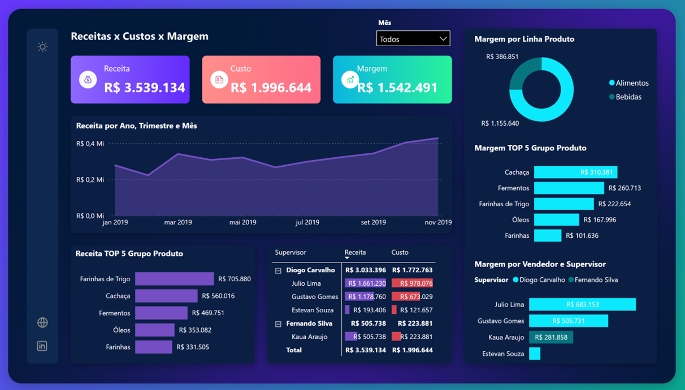

# Dashboard de Desempenho Comercial (Receitas, Custos e Margem)
### Projeto Prático — Curso Power BI (Experiun)

---

[Clique aqui para ver o Dashboard](https://app.powerbi.com/view?r=eyJrIjoiMDU3YmViODktOWJlZC00NjNjLTg3ZDMtODIyY2EyN2ZkMWMwIiwidCI6IjQwNTBmNTliLTViYTItNGEwOS04NDU4LWI2MjUwOWM0Yzk3ZCJ9)
---
## Sobre o Projeto

Este projeto foi desenvolvido como parte prática do **Curso de Power BI da Experiun**. O objetivo é transformar dados transacionais em um painel gerencial focado no monitoramento de receitas, custos operacionais e margem de contribuição.

### Principais Indicadores (KPIs):
*   **R$ Receita:** R$ 3,54 Milhões
*   **R$ Custo:** R$ 2,00 Milhões
*   **R$ Margem:** R$ 1,54 Milhões
---
## Etapas do Desenvolvimento
  
1. **ETL (Power Query):** Conexão com as planilhas Excel, higienização dos dados, tratamento de tipos e relacionamento entre as bases.
2. **Modelagem de Dados (Star Schema):** Relacionamento de cardinalidade 1:N entre a dimensão de produtos e a fato de vendas.
3. **Cálculos em DAX:** Criação de medidas dinâmicas para Receita, Custo e Margem Acumulada.
4. **Data Visualization:** Construção de interface em modo escuro (*Dark Mode*) com painel lateral de navegação e distribuição clara de cartões e gráficos de barras/rosca.
---
## 🧑‍💻 Autor

Desenvolvido por **Isaias** durante a formação na Experiun.
*   [LinkedIn]([https://linkedin.com/](https://www.linkedin.com/in/isaiassousadossantos/))
*   [Meu Site / Portfólio]([https://seu-site.com](https://isaiassantos.works/))